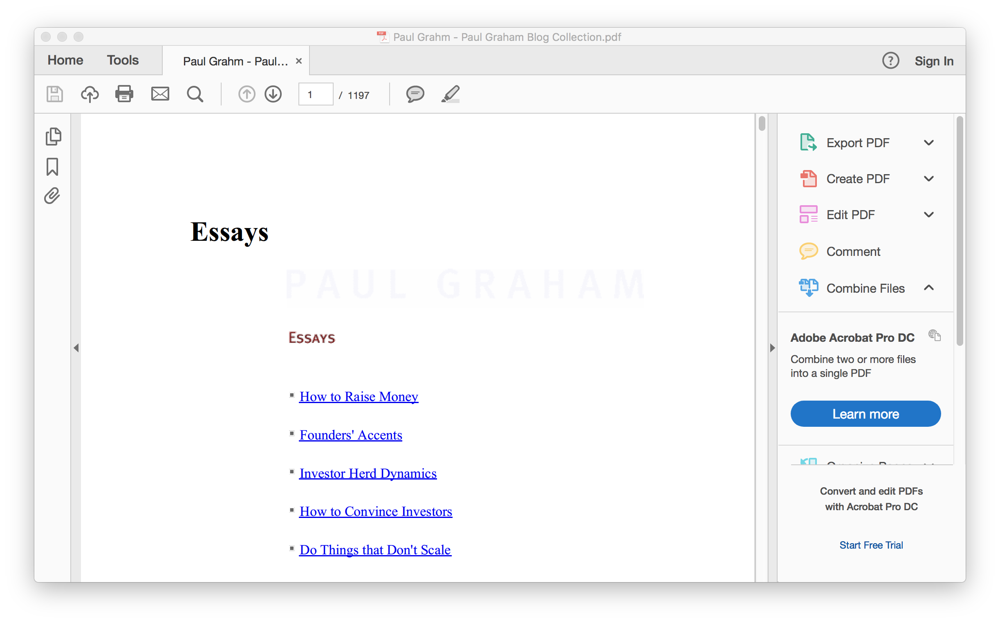

# Turn Paul Graham's blog post into single PDF book

Paul Graham is a famous angel investor, who popularised the term "hacker" in engineers circle. His book "Hacks & Painters" is a great collection of ideas and experiencese in technology, startup, meta knowledge, and world view. Some of the pieces in this book is derived from his online blogging site: http://paulgraham.com/ .

This website runs on ancient technology, making it a good example for the demo of this repo. Our purpose is to crawl the [articles](http://paulgraham.com/articles.html) and turn them into a single PDF for easier read later.

One can use the following steps:

1. `wget -r http://paulgraham.com/articles.html` to download all the article HTMLs.
2. Use pandoc to convert HTML into PDF: `ls -1 paulgraham.com | xargs -I{}  pandoc -f html -t html5 -o pdfs/{}.pdf paulgraham.com/{}`
3. Merge the PDFs into one: `pdftk pdfs/* cat output all.pdf`

The final output (`all.pdf`) is not hosted in this repo for copyright concern. You can repeat those steps to make yourself a PDF book. You are hacker right? It's good stuff to read on the a long haul airplane. :).

